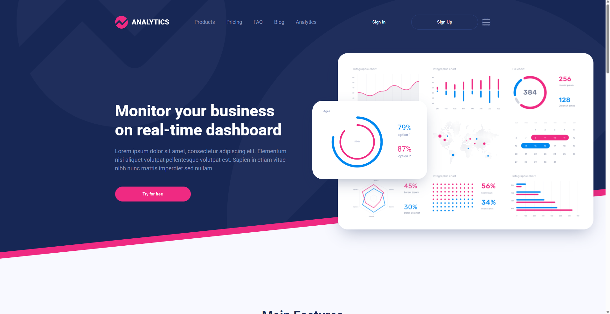

# Analytics

Лендинг аналитического сервиса: главный экран, блок возможностей, дашборд,
дорожная карта и подвал. Адаптируется под мобильные — на узких экранах секции
перестраиваются в колонку, а меню сворачивается.

**[Открыть демо →](https://alonaborealis.github.io/analytics/)**



## Стек

- Семантическая вёрстка, HTML5
- SCSS: стили разбиты по блокам (`scss/blocks/`), отдельно переменные, миксины
  и сброс; переиспользуемые части вынесены в `@mixin`
- Декоративные секции на `clip-path` и псевдоэлементах, без картинок-подложек
- Sass для сборки, browser-sync для живой перезагрузки
- ESLint и Prettier

## Структура

```
scss/
  blocks/      стили секций: intro, main-features, dashboard, roadmap, footer
  _core.scss   общие классы страницы
  _mixins.scss min-max, img, mobile
  _reset.scss  сброс браузерных стилей
  _variables.scss
  main.scss    точка сборки
css/style.css  результат компиляции, его и подключает index.html
```

## Локальный запуск

```
npm install
npm run dev
```

Поднимает сервер на http://localhost:3000 и одновременно следит за
изменениями SCSS.

## Команды

- `npm run dev` — сервер с живой перезагрузкой
- `npm run build` — собрать `scss/main.scss` в `css/style.css`
- `npm run watch` — пересобирать стили при изменении
- `npm run format` — отформатировать проект через Prettier
- `npm run format:check` — проверить форматирование, ничего не меняя
- `npm run lint` — ESLint
